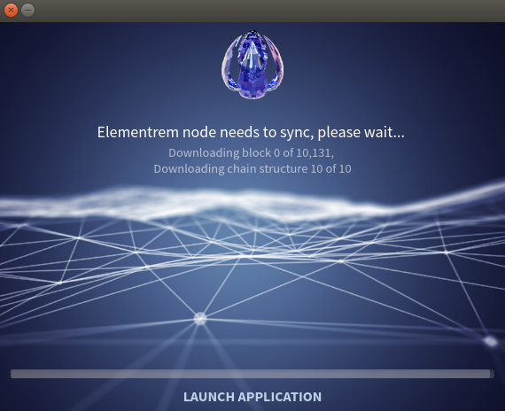
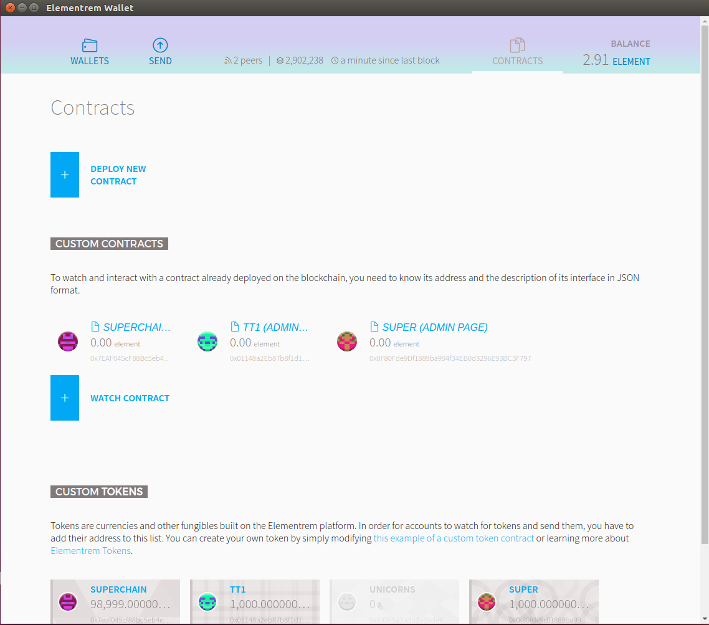
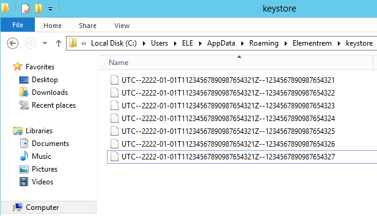
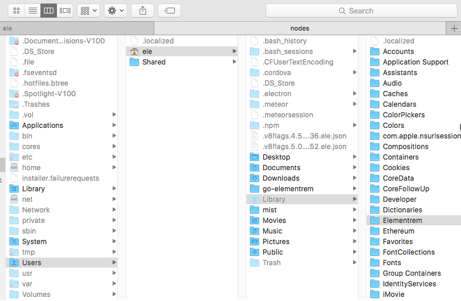
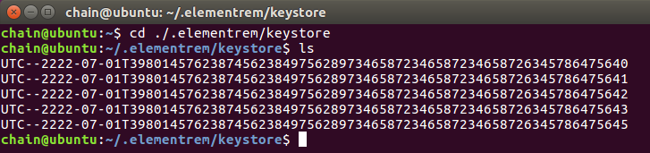

* [Elementrem Mist Wallet](#elementrem-mist-wallet)
* [Installation](#installation)
* [Install Path](#install-path)
* [Backup Wallet](#backup-wallet)
* [Troubleshooting](#troubleshooting)

# Elementrem Mist Wallet
	  
	
***   


## Installation     
### [Downalod lastest version(To build from source is unnecessary)](https://github.com/elementrem/mist/releases)   
---------------
### [To build from source](To_build_from%20source_mist.md)	


## Install Path
The paths which store your wallets database and node are different:     
    
The wallet (Mist) stores its data at:   
- Mac: ~/Library/Application Support/Elementrem_Mist   
- Windows: %APPDATA%\Roaming\Elementrem_Mist   
- Linux: ~/.config/Elementrem_Mist   
    
The nodes data is stored at:    
- Mac: ~/Library/Elementrem   
- Windows: %APPDATA%\Roaming\Elementrem   
- Linux: ~/.elementrem    


## Backup Wallet
**Your KEY address is stored at:(Directory is hidden by default.)**       
- Windows: %APPDATA%\Roaming\Elementrem\keystore   

        
        
- Mac: ~/Library/Elementrem/keystore   

        
        
- Linux: ~/.elementrem/keystore


**File in the "keystore directory" are very important. Account access is available only with keystore files.**        
**Please back up your keystore in a safe place.** ***And Do not give your password to anyone.***      

## TroubleShooting
If for some reason it can not be updated with the latest block. You can solve the problem in the same way.

- [Backup your key](#backup-wallet)
- Delete `Node Directory.`
The nodes data is stored at:    
```bash
Mac: ~/Library/Elementrem   
Windows: %APPDATA%\Roaming\Elementrem   
Linux: ~/.elementrem
``` 
- Start Elementrem-Wallet
- Wait until the block sync with the latest information.
- Put the Backup keystore file to `Node Directory.`

**If accidentally deleted a `Node Directory` without a [Backup key](#backup-wallet), All elements will be lost.**
